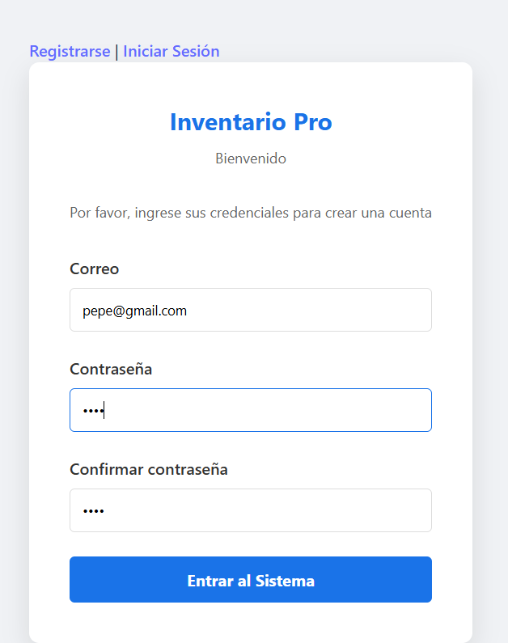
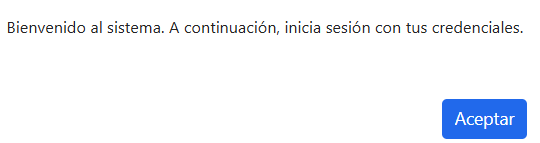
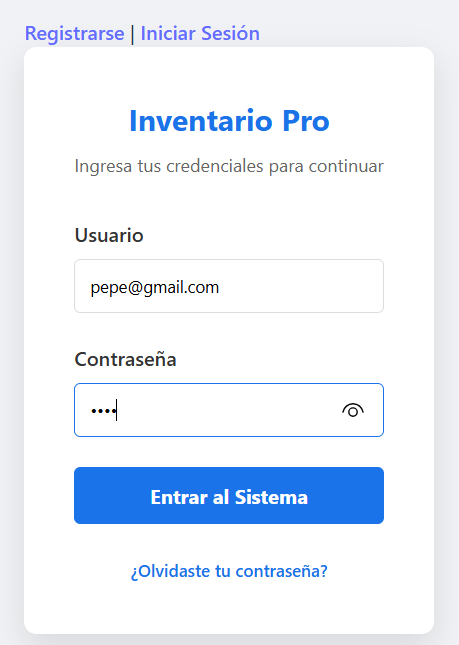
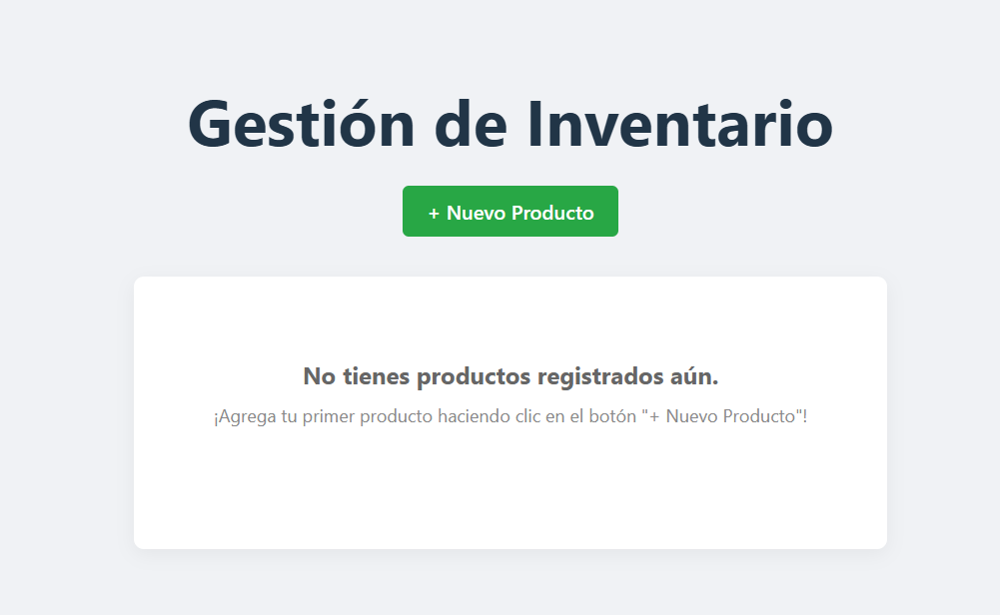
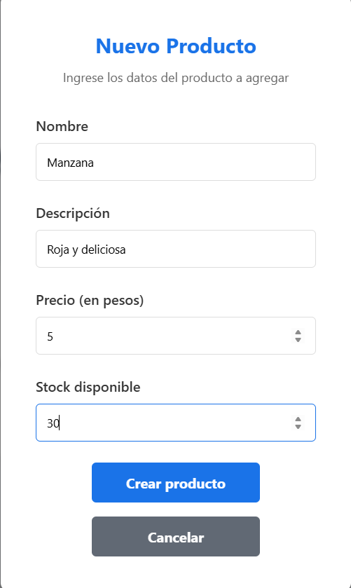
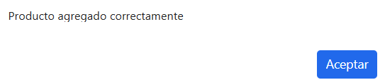
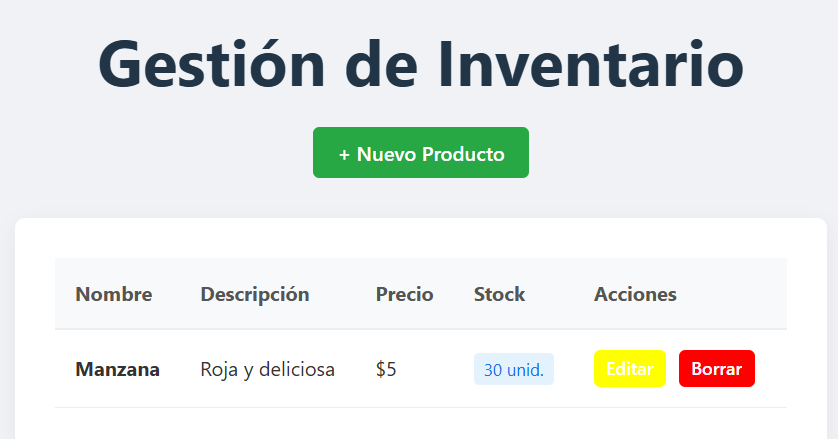
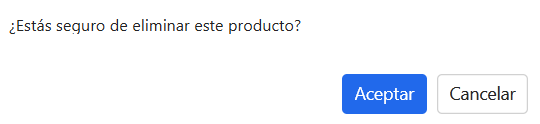
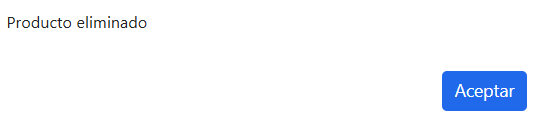
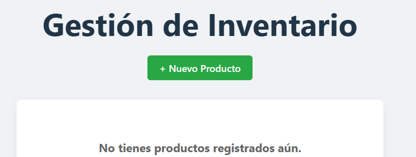

# Aplicación de Gestión de Productos

Una aplicación web completa para gestionar productos con autenticación de usuarios. Permite registrar usuarios, iniciar sesión y realizar operaciones CRUD (Crear, Leer, Actualizar, Eliminar) sobre productos.

## 🌐 Links de Producción

| Entorno | URL | Descripción |
|---------|-----|------------|
| Frontend | [https://dfs-actividad-4.vercel.app](https://dfs-actividad-4.vercel.app) | Interfaz de usuario |
| Backend | [https://dfs-actividad-4.onrender.com](https://dfs-actividad-4.onrender.com) | API REST |

## 🚀 Características

- **Autenticación de usuarios** con registro e inicio de sesión seguros
- **Gestión de productos** con operaciones CRUD completas
- **Protección de rutas** mediante tokens JWT
- **Base de datos MongoDB** para persistencia
- **Despliegue automático** con CI/CD en GitHub Actions

## 🏗️ Arquitectura

### Arquitectura General

```
┌─────────────────────────────────────────────────────────────┐
│                      Cliente (Frontend)                      │
│                    React + Vite                             │
│  ┌─────────────┐  ┌─────────────┐  ┌─────────────────────┐  │
│  │   Login     │  │  Register   │  │  ListaProductos    │  │
│  └─────────────┘  └─────────────┘  └─────────────────────┘  │
└─────────────────────────────────────────────────────────────┘
                            │
                            │ HTTPS (REST API)
                            ▼
┌─────────────────────────────────────────────────────────────┐
│                      Servidor (Backend)                     │
│                    Node.js + Express                        │
│  ┌─────────────┐  ┌─────────────┐  ┌─────────────────────┐  │
│  │   Auth      │  │  Productos  │  │   Middlewares       │  │
│  │  (JWT)      │  │   (CRUD)    │  │   (Protección)     │  │
│  └─────────────┘  └─────────────┘  └─────────────────────┘  │
└─────────────────────────────────────────────────────────────┘
                            │
                            │ MongoDB Driver
                            ▼
┌─────────────────────────────────────────────────────────────┐
│                       Base de Datos                         │
│                       MongoDB Atlas                         │
│  ┌─────────────┐                                            │
│  │  Usuarios   │◄─────────────────┐                         │
│  └─────────────┘                  │                         │
│                                  │                         │
│  ┌─────────────┐                  │ 1:N                   │
│  │  Productos │──────────────────┘                         │
│  └─────────────┘                                            │
└─────────────────────────────────────────────────────────────┘
```

### Flujo de Datos

```
Usuario → Frontend → API → Middleware → Controlador → MongoDB
          (React)    (REST)  (JWT)       (Express)    (Datos)
```

## 📊 Diagrama Entidad-Relación

```
┌─────────────────┐         1:N         ┌─────────────────┐
│     Usuario     │────────────────────│    Producto     │
├─────────────────┤                    ├─────────────────┤
│ _id (PK)        │                    │ _id (PK)        │
│ email           │                    │ nombre          │
│ password        │                    │ descripcion     │
│ createdAt       │                    │ precio          │
└─────────────────┘                    │ stock           │
                                       │ creadoPor (FK)  │
                                       │ createdAt       │
                                       │ updatedAt       │
                                       └─────────────────┘
```

### Descripción de Entidades

#### Usuario
| Campo | Tipo | Descripción |
|-------|------|-------------|
| `_id` | ObjectId | Identificador único |
| `email` | String | Correo electrónico (único) |
| `password` | String | Contraseña encriptada |
| `createdAt` | Date | Fecha de creación |

#### Producto
| Campo | Tipo | Descripción |
|-------|------|-------------|
| `_id` | ObjectId | Identificador único |
| `nombre` | String | Nombre del producto |
| `descripcion` | String | Descripción detallada |
| `precio` | Number | Precio unitario |
| `stock` | Number | Cantidad disponible |
| `creadoPor` | ObjectId | Referencia a Usuario |
| `createdAt` | Date | Fecha de creación |
| `updatedAt` | Date | Fecha de última modificación |

### Relaciones
- **Usuario → Producto**: Uno a Muchos (1:N)
  - Un usuario puede crear muchos productos
  - Cada producto pertenece a un solo usuario

## 🛠️ Tecnologías

### Frontend
- **React** - Biblioteca de UI
- **Vite** - Build tool
- **React Router** - Navegación
- **CSS** - Estilos

### Backend
- **Node.js** - Entorno de ejecución
- **Express** - Framework web
- **MongoDB** - Base de datos
- **Mongoose** - ODM de MongoDB
- **JWT** - Autenticación
- **bcryptjs** - Encriptación de contraseñas

## 📦 Instalación

### Prerrequisitos
- Node.js 18+
- MongoDB (local o Atlas)

### Backend

```bash
cd backend
npm install
```

Configurar variables de entorno en `backend/.env`:
```env
MONGODB_URI=mongodb://localhost:27017/gestion_productos
JWT_SECRET=tu_secreto_jwt
PORT=3000
```

Iniciar servidor:
```bash
npm start
```

### Frontend

```bash
cd frontend/react-app-productos
npm install
npm run dev
```

## 🔌 API Endpoints

### Autenticación
| Método | Endpoint | Descripción |
|--------|----------|-------------|
| POST | `/api/register` | Registrar nuevo usuario |
| POST | `/api/login` | Iniciar sesión |

### Productos (requieren token JWT)
| Método | Endpoint | Descripción |
|--------|----------|-------------|
| GET | `/api/productos` | Listar productos del usuario |
| POST | `/api/productos` | Crear producto |
| PUT | `/api/productos/:id` | Actualizar producto |
| DELETE | `/api/productos/:id` | Eliminar producto |

## 🧪 Tests

```bash
cd backend
npm test
```

## 🚀 Despliegue

### Frontend
Desplegado en **Vercel**: [https://dfs-actividad-4.vercel.app](https://dfs-actividad-4.vercel.app)

### Backend
Desplegado en **Render**: [https://dfs-actividad-4.onrender.com](https://dfs-actividad-4.onrender.com)

### Base de Datos
Desplegado en **MongoDB Atlas**: [https://www.mongodb.com/cloud/atlas](https://www.mongodb.com/cloud/atlas)

### CI/CD
El pipeline de GitHub Actions ([`.github/workflows/main_deploy.yml`](.github/workflows/main_deploy.yml)):
1. Verifica el build del frontend
2. Despliega automáticamente a Vercel
3. Dispara el despliegue del backend en Render

## 🔐 Seguridad

- Contraseñas encriptadas con bcrypt
- Tokens JWT con expiración de 1 hora
- Middleware de autenticación en rutas protegidas
- Validación de IDs de MongoDB

## ⚠️ Códigos de Error

### Códigos HTTP

| Código | Significado | Descripción |
|--------|-------------|-------------|
| 200 | OK | Solicitud exitosa |
| 201 | Created | Recurso creado exitosamente |
| 400 | Bad Request | Datos inválidos en la solicitud |
| 401 | Unauthorized | Token JWT inválido o expirado |
| 404 | Not Found | Recurso no encontrado |
| 500 | Internal Server Error | Error en el servidor |

### Errores de la Aplicación

#### Autenticación
| Código | Mensaje | Solución |
|--------|---------|----------|
| 404 | "Usuario no encontrado" | Verificar email registrado |
| 401 | "Contraseña incorrecta" | Verificar contraseña |
| 500 | "Error al registrar usuario" | Email ya existente o error de conexión |

#### Productos
| Código | Mensaje | Solución |
|--------|---------|----------|
| 404 | "No se encontraron productos para este usuario" | Agregar productos nuevos |
| 404 | "Producto no encontrado o no pertenece al usuario" | Verificar ID del producto |
| 400 | "ID de producto no válido" | Verificar formato del ObjectId |
| 500 | "Error al obtener productos" | Error de conexión a BD |
| 500 | "Error al crear el producto" | Datos incompletos |
| 500 | "Error al actualizar el producto" | Error de validación |
| 500 | "Error al eliminar el producto" | Error de conexión a BD |

### Errores Comunes

#### "Token inválido"
**Causa:** Token JWT expirado o malformado  
**Solución:** Volver a iniciar sesión

#### "Not authorized"
**Causa:** No hay token en la solicitud  
**Solución:** Incluir header `Authorization: Bearer <token>`

#### "ECONNREFUSED"
**Causa:** MongoDB no está disponible  
**Solución:** Verificar conexión a MongoDB

## 📁 Estructura del Proyecto

```
backend/
├── index.js              # Entry point
├── server.js             # Servidor
├── shema.js              # Modelos
├── routes/
│   ├── productos.js     # Rutas de productos
│   └── usuarios.js      # Rutas de auth
├── middlewares/
│   └── auth.js          # Verificación JWT
└── tests/
    └── productos.test.js
```

```
frontend/react-app-productos/
├── src/
│   ├── App.jsx          # Router y rutas protegidas
│   └── components/
│       ├── Login.jsx     # Login
│       ├── Register.jsx  # Registro
│       ├── ListaProductos.jsx  # Dashboard
│       ├── EditarProducto.jsx  # Editar
│       └── NuevoProducto.jsx   # Crear
└── package.json
```

## Demostracion de el funcionamiento de la aplicacion
Para ver el funcionamiento de la aplicacion se puede acceder a la siguiente url: [https://dfs-actividad-4.vercel.app](https://dfs-actividad-4.vercel.app) y probar las funcionalidades de registro, login y gestion de productos.

Al ingresar lo primero que se muestra es el formulario de login, donde se puede ingresar con un usuario registrado o crear uno nuevo. En este caso se puede usar el siguiente usuario de prueba:

<p align="center">
  
</p>


Despues de crear una cuenta, se le lleva al usuario a la pagina de login, donde se puede ingresar con el email y contraseña registrados. Si el login es exitoso, se muestra un mensaje de bienvenida y se redirige al dashboard de productos.

<p align="center">
  
</p>
<p align="center">
  
</p>

Una vez en el dashboard, se pueden ver los productos registrados por el usuario, con opciones para editar o eliminar cada producto. Tambien se puede agregar un nuevo producto usando el formulario correspondiente. Como no tenemos productos registrados, se muestra un mensaje indicando que no hay productos disponibles. Al agregar un nuevo producto, este se muestra en la lista con sus detalles y opciones de edición y eliminación.

<p align="center">
  
</p>
<p align="center">
  
</p>
<p align="center">
  
</p>
<p align="center">
  
</p>

A continuacion, editamos el producto creado, cambiando su nombre y precio. Al guardar los cambios, se actualiza la informacion del producto en la lista.

<p align="center">
  
</p>
<p align="center">
  
</p>
<p align="center">
  
</p>

Finalmente, eliminamos el producto editado. Al confirmar la eliminacion, el producto desaparece de la lista y se muestra un mensaje de confirmacion.

<p align="center">
  
</p>
<p align="center">
  
</p>
<p align="center">
  
</p>